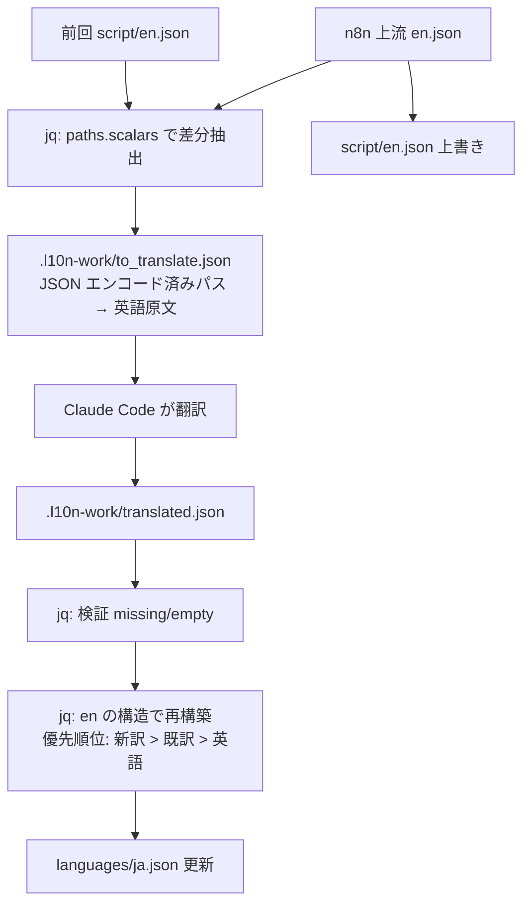

## はじめに

n8n のような OSS の UI 文言を日本語化するとき、ロケールファイル `en.json` は数千キーに膨らみます。本稿で扱う [n8n-i18n-japanese](https://github.com/YukiOno-1015/n8n-i18n-japanese) では、現時点で **4136 行（パス数で約 1700 キー）**の `en.json` を継続的に追従する必要があります。

LLM に全文を投げて翻訳生成させる、という素朴な実装には致命的な問題が三つあります。

- **コスト**: 上流 (`n8n-io/n8n`) は数週間に 1 回マイナーリリースを切る。毎回 1700 キー全部を投げると入出力トークンが嵩む
- **速度**: 全キー処理は LLM の生成時間とリトライ込みで数分〜十数分
- **揺らぎ**: 既に翻訳済みのキーまで再生成され、訳語ゆれや誤訳の混入リスクが上がる

本稿では、決定論的な前後処理を **jq** に任せ、LLM には **差分キーの英語原文だけ** を翻訳させる「分業パイプライン」の作り方を、実際に GitHub Actions 上で動いている実装ベースで解説します。

## つくったもの

リポジトリ:

<!-- markdownlint-disable-next-line MD034 -->
https://github.com/YukiOno-1015/n8n-i18n-japanese

主要ワークフロー: [`.github/workflows/n8n-monitor-pr.yml`](https://github.com/YukiOno-1015/n8n-i18n-japanese/blob/main/.github/workflows/n8n-monitor-pr.yml)

- n8n の新バージョンを毎時検知
- 上流の `en.json` と前回追跡コピー (`script/en.json`) を **jq で diff**
- 差分キーだけ Claude Code に翻訳依頼
- 翻訳結果を **jq で `languages/ja.json` にマージ** (最新英語のキー順で再構築)
- 自動 PR → 自動マージ → リリース

## 全体フロー



ポイント: **生成タスク以外は全部 jq**。LLM は「英文 → 和文」の純粋な変換責任だけを持ちます。

## 1. 差分抽出: パスを丸ごと辞書のキーにする

ロケール JSON は階層構造です。

```json
{
  "common": {
    "save": "Save",
    "delete": "Delete"
  },
  "nodeView": {
    "tabs": {
      "executions": "Executions"
    }
  }
}
```

これを「リーフ単位のフラット辞書」へ落として、追加・変更されたキーだけを残します。

```bash
jq -n \
  --slurpfile en  "$new_en" \
  --slurpfile old "$old_src" '
  ($en[0]) as $EN | ($old[0] // {}) as $O
  | reduce ($EN | paths(scalars)) as $p ({};
      (try ($O | getpath($p)) catch null) as $ov
      | ($EN | getpath($p)) as $nv
      | if ($ov == null) or ($ov != $nv)
        then .[$p | tojson] = $nv
        else . end)
  ' > "$work_dir/to_translate.json"
```

仕組み:

- `paths(scalars)` で最新 `en.json` の **全リーフへのパスの配列**を列挙する（例: `["nodeView","tabs","executions"]`）
- 各パスについて旧 `en.json` の同じ位置の値を `getpath` で取り、新値と異なるなら出力に積む
- パスは配列のままだとオブジェクトのキーに使えないため、`$p | tojson` で **JSON 文字列に再エンコード** してキー化する

出力 `to_translate.json` はこういう形になります。

```json
{
  "[\"common\",\"save\"]": "Save",
  "[\"nodeView\",\"tabs\",\"executions\"]": "Executions"
}
```

**この形にしておく利点**:

- LLM へのプロンプトが「平らな辞書を翻訳して」というシンプルな命題になる
- キー一致を後段で **完全一致** で検証できる（パスごと比較なので階層構造の取り違えが起きない）
- 入力エントリ数を `jq 'length'` で即数えられる（コスト概算可能）

## 2. LLM への投入: 制約は明示的に書く

差分が抽出できたら、Claude Code に投げます。本リポでは [`anthropics/claude-code-action`](https://github.com/anthropics/claude-code-action) を Actions 内で実行しています。

```yaml
- name: Translate locale diff (Claude Code)
  if: steps.already_done.outputs.skip == 'false' && steps.worklist.outputs.count != '0'
  timeout-minutes: 30
  uses: anthropics/claude-code-action@v1
  with:
    claude_code_oauth_token: ${{ secrets.CLAUDE_CODE_OAUTH_TOKEN }}
    github_token: ${{ secrets.GITHUB_TOKEN }}
    prompt: |
      n8n の UI 文言を英語から日本語へ翻訳するタスク。
      入力ファイル: .l10n-work/to_translate.json
        （JSON オブジェクト。各エントリは "不透明なキー": "英語原文"）
      出力ファイル: .l10n-work/translated.json
      手順:
      1. .l10n-work/to_translate.json を読む。
      2. 各エントリの英語原文を、UI 文言として自然な日本語へ翻訳する。
      3. キーは一字一句そのまま（変更・整形・並べ替え禁止）、値だけを
         日本語に置き換えた JSON オブジェクトを .l10n-work/translated.json に書く。
         入力と出力のキー集合は完全一致させ、全エントリを漏れなく翻訳する。
      プレースホルダ（{name} や {{count}} 等）と HTML タグはそのまま保持する。
      .l10n-work/translated.json のみを作成・編集し、他のファイルや
      git の commit / push・ブランチ作成はしないこと。
    claude_args: |
      --max-turns 60
      --allowedTools "Read,Write,Edit,Glob,Grep"
```

**プロンプト設計で意識した点**:

- キーは「**不透明な識別子**」と明示する。LLM がキーの内容を解釈・整形しないようにする
- 入力と出力の **キー集合の完全一致** を明示的に要求する（落としや増分を防ぐ）
- プレースホルダ / HTML タグの保持を明文化（`{name}` を `{名前}` にされると壊れる）
- 翻訳タスク以外（commit / push / 他ファイル変更）を明示的に禁止する。Claude Code は手が出やすいので「やるなリスト」が要る

`--allowedTools "Read,Write,Edit,Glob,Grep"` で、ファイル操作だけに権限を絞っています。`Bash` を渡さないので余計なシェル実行も起きません。

## 3. 検証: 「翻訳が抜けた」を即時検出する

LLM 出力をそのままマージするのは危険です。途中で諦めて空文字を入れたり、キーをいくつか落としたりすることがあります。検証は **jq だけで完結** できます。

```bash
missing=$(jq -n \
  --slurpfile s "$work_dir/to_translate.json" \
  --slurpfile t "$work_dir/translated.json" '
  ($s[0] | keys_unsorted) as $sk | ($t[0]) as $T
  | [ $sk[] | select(($T[.] | type) != "string" or ($T[.] | length) == 0) ]')

n=$(echo "$missing" | jq 'length')
if [[ "$n" != "0" ]]; then
  echo "Untranslated or missing keys: $n" >&2
  echo "$missing" | jq -r '.[0:20][]' >&2
  exit 1
fi
```

入力側のキーを `keys_unsorted` で列挙し、それぞれが出力側で **文字列かつ空でない** かを判定します。不合格があれば「先頭 20 件」を `stderr` に出して落とします。これで CI が静かに半端な翻訳をマージする事故を防げます。

:::note warn
**LLM の出力フォーマットは信用しない**。本稿の構造でも、Claude Code は時折出力ファイルの JSON 末尾にコメント風の説明を書き足してくることがあります。`jq` でパースして検証する設計にしておけば、その種の汚染は自動的に弾けます。
:::

## 4. マージ: 最新英語の構造で再構築する

翻訳結果を既存の `languages/ja.json` に「上書きマージ」しません。**最新英語の `en.json` の構造を雛形にして、ja.json を一から作り直す** のがコツです。

```bash
jq -n \
  --slurpfile en  "$new_en" \
  --slurpfile cur "$ja_file" \
  --slurpfile tr  "$tr_file" '
  ($en[0]) as $EN | ($cur[0]) as $C | ($tr[0]) as $T
  | reduce ($EN | paths(scalars)) as $p ({};
      ($T[$p | tojson]) as $tv
      | (try ($C | getpath($p)) catch null) as $cv
      | setpath($p;
          if $tv != null then $tv
          elif $cv != null then $cv
          else ($EN | getpath($p)) end))
  ' > "$work_dir/ja_merged.json"

mv "$work_dir/ja_merged.json" "$ja_file"
cp "$new_en" "$GITHUB_WORKSPACE/script/en.json"
```

**設計のポイント**:

- 最新英語の `paths(scalars)` を全リーフ列挙し、各リーフごとに値を選ぶ
- 値の優先順位は **新訳 > 既存の和訳 > 英語原文** で **明文化**。最後の「英語原文」フォールバックがあるおかげで、未訳のまま壊れずに動く
- **上流で削除されたキーは最新英語に存在しないので自動的に除外** される。「ja.json だけ古いキーが残る」「肥大化する」が防げる
- ループの最後で `setpath` でリーフへ値をセットするので、`en.json` のキー順がそのまま保たれる（差分レビューしやすい）

最後に `script/en.json` を新しい英語ロケールで上書きすれば、**次回の差分計算で「前回の英語」として正しく使われる**。状態管理はファイル 1 個で済みます。

## 5. ハマりやすかった落とし穴

### a. `paths(scalars)` を `paths` にすると爆発する

`paths` は中間ノード（オブジェクト・配列）のパスも返します。リーフ単位の処理を意図して `paths(scalars)` にする必要があります。

### b. パスを `join(".")` でキー化しない

ドット区切りでキー化すると、元の英語値にドットが含まれた場合の **逆引きで衝突** します。`tojson` で JSON 文字列化すれば曖昧性ゼロ。

### c. LLM が「気を利かせて」キー名を整形する

`nodeView.tabs.executions` のような UI 寄りキーを目にすると、LLM は時折それ自体を翻訳しようとします。プロンプトで **「キーは不透明な識別子。一字一句変えない」** を必ず書いておきます。

### d. 部分置換マージは順序が崩れる

「ja.json を既存の構造のまま、変更キーだけ差し替え」をやろうとすると、上流で順序が変わったキーの追従が破綻します。**毎回 en.json を雛形に再構築** する方が安定。

### e. en.json のコミット忘れ

`script/en.json` の更新を忘れると **毎回同じ差分が抽出され続ける** ことになり、コスト爆発します。マージステップで必ず `cp "$new_en" "$GITHUB_WORKSPACE/script/en.json"` を実行する。

## 6. 他言語への一般化

このパイプラインは「言語固有部分」をプロンプトと出力先ファイル名にしか持たないので、`languages/` 配下に `ko.json` `zh-CN.json` 等を増やしていくのは簡単です。

```bash
for lang in ja ko zh-CN; do
  diff_extract en old → to_translate_${lang}.json
  llm_translate to_translate_${lang}.json → translated_${lang}.json --lang=$lang
  jq merge → languages/${lang}.json
done
cp new_en script/en.json
```

LLM の翻訳パートだけを差し替えれば、別ドメイン (Vue I18n / i18next / gettext .po) にも転用できます。要は **「決定論的な前後処理 + 純粋な変換だけ LLM」** という分業の枠を作ることです。

## まとめ

- 巨大なロケール JSON を LLM に全文丸投げするのは、コスト・速度・揺らぎの三重苦
- **jq で差分抽出 + LLM で純粋な翻訳 + jq でマージ** という分業に切ると、安定して継続運用できる
- 入力フォーマットは **「JSON エンコードしたパス → 英語原文」の平坦な辞書** に正規化する
- 出力検証は **jq だけで完結** できるので、CI に組み込みやすい
- マージは **最新英語の構造を雛形に再構築** する（差分置換しない）

n8n の上流追従はこの構成にしてからほぼ無人で回っています。同じパターンで継続翻訳に困っている方の参考になれば。

リポジトリ:

<!-- markdownlint-disable-next-line MD034 -->
https://github.com/YukiOno-1015/n8n-i18n-japanese

関連記事:

- [n8n 日本語化プロジェクトの全体構成と CI/CD](https://github.com/YukiOno-1015/n8n-i18n-japanese/blob/main/docs/qiita-article.md)（同リポの全体紹介記事ドラフト）
