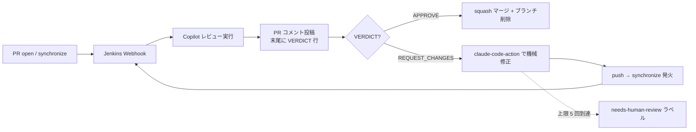

## はじめに

[n8n](https://n8n.io/) はノードベースで動かせる OSS のワークフロー自動化ツールです。公式 UI は英語中心で、日本語ロケールは PR ベースで進化しているもののリリース追従が手作業になりがちです。

そこで、本記事で紹介するリポジトリ [YukiOno-1015/n8n-i18n-japanese](https://github.com/YukiOno-1015/n8n-i18n-japanese) では、

- **n8n 新バージョンの検知**
- **差分翻訳（Claude Code + jq）**
- **`editor-ui` のビルド・パッチ適用**
- **GitHub Release / Docker Hub への配信**

までを GitHub Actions で **無人運用** しています。さらに、日本語化済みの `n8n-ja` Docker イメージには **Claude Code CLI を同梱** でき、n8n ワークフロー内から `claude` を呼び出して LLM 処理を組み込めるようにしました。

この記事では、その構成と工夫をまとめます。

## つくったもの

リポジトリはこちらです。

<!-- markdownlint-disable-next-line MD034 -->
https://github.com/YukiOno-1015/n8n-i18n-japanese

GitHub Releases からビルド済みの日本語化パッケージ（`editor-ui.tar.gz`）と `languages/ja.json` をダウンロードでき、`docker-compose.yml` も同梱しているのですぐ試せます。

```shell
git clone https://github.com/YukiOno-1015/n8n-i18n-japanese.git
cd n8n-i18n-japanese
# Releases から editor-ui.tar.gz を取得して展開
docker-compose up
```

## フォーク元との違い

このリポジトリは [`nemumusito/n8n-i18n-japanese`](https://github.com/nemumusito/n8n-i18n-japanese) （大元は [`other-blowsnow/n8n-i18n-chinese`](https://github.com/other-blowsnow/n8n-i18n-chinese)）からのフォークです。主な改修ポイントは以下です。

| 領域 | フォーク元 | 本フォーク |
|------|-----------|-----------|
| 翻訳エンジン | Gemini API（`gemini-pro`） | **Claude Code ベース**（GitHub Actions 上で差分翻訳） |
| 翻訳方式 | ファイル全体を API へ投げて生成 | **jq で差分キー抽出 → Claude が翻訳 → jq でマージ** |
| 更新検知 | 手動／単一ワークフロー | n8n 新版を **毎時自動検知** |
| リリース | `editor-ui` パッケージ化のみ | **GitHub Release + Docker Hub + git tag** を自動発行 |
| 自動化 | なし | 検知 → 翻訳 → PR → **自動マージ** → リリースまで無人 |
| 失敗対応 | なし | **auto-heal**：失敗時に Claude が診断し修正 PR/issue を自動作成 |
| 配布イメージ | なし | **`n8n-ja` イメージ**（日本語化済み・Claude Code CLI 同梱可） |

## 1. 翻訳エンジンの刷新：jq × Claude Code

n8n のロケールファイル `en.json` は数千キーあり、毎回 LLM に全文投げると **遅い・高い・揺れる** の三重苦になります。本フォークでは **決定論的処理は jq、知的処理は Claude** という分業に変えました。

### 差分翻訳のフロー

1. n8n upstream の最新 `en.json` を取得
2. ローカルの前回コピー `script/en.json` と **jq で差分抽出**（追加・変更キーのみ）
3. その差分だけを Claude Code に投げて翻訳
4. 翻訳結果を **jq で `languages/ja.json` にマージ**し、最新英語のキー順で再構築
5. `script/en.json` を新しい英語ロケールで上書き

:::note info
全文書き換えはやらず、ソート・マージなど決定論的な操作は jq に任せます。LLM はテキスト変換の責務だけ持つので、出力の揺らぎが致命的な競合に発展しません。
:::

`.n8n-upstream-version` で追従中の n8n バージョンを明示的に追跡し、PR タイトル・コミットにも反映するようにしています。

## 2. CI/CD の完全自動化（4 ワークフロー構成）

フォーク元の単一ワークフローを廃し、責務を分けた 4 本に再編しました。

| ワークフロー | 役割 |
|-------------|------|
| [`n8n-monitor-pr.yml`](https://github.com/YukiOno-1015/n8n-i18n-japanese/blob/main/.github/workflows/n8n-monitor-pr.yml) | n8n 新版を毎時検知 → 差分翻訳 → `editor-ui` パッチ適用/自動修復 → ビルド → PR 作成 → 自動マージ |
| [`release-ja.yml`](https://github.com/YukiOno-1015/n8n-i18n-japanese/blob/main/.github/workflows/release-ja.yml) | main 反映後に GitHub Release / Docker Hub イメージ / git tag を発行 |
| [`pr-validate.yml`](https://github.com/YukiOno-1015/n8n-i18n-japanese/blob/main/.github/workflows/pr-validate.yml) | PR の検証（フォーマット / lint / `docker compose` スモークテスト） |
| [`auto-heal.yml`](https://github.com/YukiOno-1015/n8n-i18n-japanese/blob/main/.github/workflows/auto-heal.yml) | 上記が失敗したとき Claude が失敗ログを診断し、修正 PR（要レビュー）または issue を自動作成 |

### ハマりやすかったポイント

- **GitHub の `GITHUB_TOKEN` で作った PR では他ワークフローが発火しない**ため、自動 PR は `RELEASE_PAT`（PAT）で作成し、マージ後にリリースを連鎖させる
- リリースは locale / version 関連の変更のみ発火させる（`paths` フィルタ）＋重複ガード
- `concurrency` で同名実行を待避、ジョブ/ステップに `timeout-minutes` を必ず付与

これらは [PR #29](https://github.com/YukiOno-1015/n8n-i18n-japanese/pull/29) でまとめて入れました。

### 失敗時の auto-heal

最も気を遣ったのが「夜中に壊れて翌朝まで止まる」状態を作らないことです。`auto-heal.yml` は失敗イベントを契機に、Claude へ失敗ログとリポジトリ状態を渡し、

- 自明な修正は **修正 PR を起こす（自動マージはせず人レビュー必須）**
- 自動で直せないものは **issue にスタックトレースと再現手順を整理して起票**

という挙動にしてあります。失敗を必ず「人が把握できる形」に落とすのがポイントです。

## 3. 配布イメージ `n8n-ja`

フォーク元には配布用イメージが無く、`docker-compose` で素の `n8nio/n8n` に `editor-ui-dist` をマウントする形でした。本フォークでは [`Dockerfile.n8n-ja`](https://github.com/YukiOno-1015/n8n-i18n-japanese/blob/main/Dockerfile.n8n-ja) でビルドした `n8n-ja` イメージを Docker Hub に公開しています。

ポイントは以下。

- **マルチステージビルド**：`editor-ui.tar.gz` を取得・展開する使い捨てステージを `alpine:3.20` で組み、本体 `n8nio/n8n:${N8N_VERSION}` へ `COPY --from=` で配置
- **既定環境変数**：`ENV N8N_DEFAULT_LOCALE=ja`
- **タグ採番**：同一 n8n バージョンに対して `-ja.N` をインクリメント（例：`2.17.2-ja.1`）

## 4. Claude Code CLI 同梱イメージ

n8n のワークフロー内（Execute Command ノードなど）から **`claude` を直接呼べる** ように、Claude Code CLI を任意で同梱できます。

### 同梱可否はビルド ARG で制御

```dockerfile
ARG CLAUDE_CODE_VERSION=latest
ARG INSTALL_CLAUDE_CODE=false

RUN if [ "$INSTALL_CLAUDE_CODE" = "true" ]; then \
      npm install -g @anthropic-ai/claude-code@${CLAUDE_CODE_VERSION}; \
      npm cache clean --force; \
      ln -sf "$(npm prefix -g)/bin/claude" /usr/local/lib/claude-real; \
      # 認証 env をチェックするラッパーを設置
      ... ; \
    fi
```

### 認証は実行時 env で外だし

イメージにトークンを焼き込まず、コンテナ env に以下のどちらかが入っていれば動きます。

| 方式 | 環境変数 | 取得方法 |
|------|----------|----------|
| API トークン | `ANTHROPIC_API_KEY` | Anthropic コンソールで発行 |
| サブスク (OAuth) | `CLAUDE_CODE_OAUTH_TOKEN` | ローカルで `claude setup-token` を実行 |

両方とも未設定なら、`/usr/local/bin/claude` のラッパーがメッセージを出して `exit 1` します。**誤って未認証のままワークフローを走らせない** ためです。

```sh
#!/bin/sh
if [ -z "$ANTHROPIC_API_KEY" ] && [ -z "$CLAUDE_CODE_OAUTH_TOKEN" ]; then
  echo "claude: 認証用 env (ANTHROPIC_API_KEY / CLAUDE_CODE_OAUTH_TOKEN) が未設定のため起動しません。" >&2
  exit 1
fi
exec /usr/local/lib/claude-real "$@"
```

### n8n ワークフローから呼ぶ

Execute Command ノードでヘッドレス実行します。出力は JSON で受け取ると後続処理が安定します。

```bash
claude -p "要約して: n8nとは何か" --output-format json --model claude-sonnet-4-6
```

後段の Code ノードでパース：

```js
return [{ json: { result: JSON.parse($json.stdout).result } }];
```

### シェルエスケープに注意

n8n 式を文字列連結でそのまま渡すと、引用符・改行で壊れたり **コマンドインジェクション** のリスクがあります。`JSON.stringify` で安全に囲みましょう。

```text
claude -p {{ JSON.stringify($json.prompt) }} --output-format json
```

長文・複雑な入力は一旦ファイルに落とすのが安全です。

```bash
printf '%s' {{ JSON.stringify($json.prompt) }} > /tmp/p.txt \
  && claude -p "$(cat /tmp/p.txt)" --output-format json
```

:::note warn
ヘッドレスでは権限プロンプトを出せないため、ツール（Read/Write/Edit など）を使わせる場合は `--allowedTools` と `--permission-mode acceptEdits` を明示してください。テキスト生成だけなら不要です。
:::

## 今後の課題と懸念点

無人運用の便利さと引き換えに、**自動 PR をレビューする人間が事実上いない** という構造的なリスクが残っています。

- monitor → 翻訳 → PR → 自動マージの動線は、PR を起こした主体も承認する主体も Bot で、**第三者レビューが入らない**
- `pr-validate.yml` で機械的なチェック（JSON 妥当性 / lint / `docker compose` スモーク）は通すが、翻訳の **訳語ゆれ・口調・固有名詞** といったセマンティックな品質までは見れない
- 失敗時に `auto-heal` で生まれる修正 PR は「人レビュー必須」にしているが、**正常系の翻訳 PR がノーチェックで main に入る** のはバランスが悪い

### 当初案と直面した制約

第一感としては **GitHub Copilot のコードレビュー機能** を自動 PR に紐付ける案でした。`request_copilot_review` で PR にレビューを要求すれば、`@copilot` がコードを読んで指摘してくれます。

ただし、現状の制約が重なって素直には採用できませんでした。

- **Copilot Pro+ の新規受付が停止中**：個人リポでの自動レビュー機能は Pro+ 契約が前提だが、新規契約自体が止まっている
- **会社用 GitHub アカウントの Pro+ を公開 OSS リポのオーナーにしたくない**：identity 漏れを避けたい
- **Org に移管 + Copilot Business**：理屈上は通るが、追加コスト + 公開リポの URL 変更 + Secrets 再投入が発生

### 採用方針：Jenkins + VERDICT 駆動の自動マージ／自動修正ループ

既に Webhook 受け口を Jenkins に用意していたため、**Copilot CLI を Jenkins から呼び、結果を PR コメントに投稿** する構成に寄せました。レビューコメント末尾の `VERDICT: APPROVE | REQUEST_CHANGES` を契約として、GitHub Actions 側で次のように分岐させます。



実装は `.github/workflows/copilot-review-handler.yml` を追加し、`issue_comment` イベントを起点に `triage` → `auto-merge` / `auto-fix` / `give-up` の 4 ジョブに分岐させています。**指摘事項を人間が読まなくても、Claude が自動で diff 修正してリトライ** するのがミソです。

ゲート条件は厳しめにかけてあります。

- コメント送信者は `vars.JENKINS_BOT_USERNAME` と一致するアカウントのみ
- 対象 PR は自動ブランチ命名（`auto-heal/*` / `auto/n8n-*-ja`）＋特定ラベル（`auto-heal` / `automated` / `n8n-update`）に限定
- 同一 PR 上でのループ回数を Jenkins コメント数で計測し、**5 回到達で `needs-human-review` を付与して停止**

### n8n 介在案（並列検討）

本リポは `n8n-ja` イメージ（Claude Code CLI 同梱）を配布しているため、**n8n 自身でレビューパイプラインを組む dogfooding 案** も並行して検討しました。

```text
[Webhook ノード] PR opened/sync（HMAC 検証）
  → [HTTP Request] gh API で diff 取得
  → [Code] 差分整形・サイズ制限
  → [Execute Command] claude -p（n8n-ja 同梱 CLI）
  → [HTTP Request] PR コメント投稿（末尾に VERDICT）
```

最終的には Jenkins に寄せましたが（既存資産活用・Credentials 管理の堅さ）、**プロジェクトのストーリーとしては n8n 流用も筋が良い** ため、将来的にレビューパイプラインを n8n 側へ移植することも視野に入れています。

### 残課題

- **PAT 運用**：Fine-grained PAT を Copilot 認証 / Actions マージ用で分離管理 + ローテーション
- **Branch protection と Bot レビューの関係**：Copilot は approving review を出さない仕様の場合があり、required reviewer 条件としては使えない。`RELEASE_PAT` のマージ権限で通す前提
- **翻訳 PR 特有の巨大差分**：`languages/ja.json` 全置換に近い PR では Copilot / Claude への入力サイズが膨らみがち。差分をキー単位に分解して投入する前処理が必要
- **重大変更の検知**：キー削除・大規模差分検知時は自動修正ループに乗せず、明示的に人手レビューへ強制エスカレーション

「無人で速く回す」と「品質を担保する」を両立させるには、**第三者レビュワーをパイプラインに組み込みつつ、レビュー指摘を別の LLM が自動修正する二段構え** が現状の現実解だと考えています。

## まとめ

- n8n の日本語化を「翻訳」だけでなく **「上流追従と配信」までを自動化** すると一気に運用が楽になる
- **jq × LLM の分業** にすると、差分だけ翻訳でき、コスト・速度・再現性が安定する
- 配布イメージに **Claude Code CLI を同梱** することで、n8n のワークフロー自体に LLM 処理を組み込める
- 失敗を握り潰さないように **auto-heal で必ず PR/issue 化** する設計が無人運用の鍵

リポジトリと Releases はこちらです。

<!-- markdownlint-disable-next-line MD034 -->
https://github.com/YukiOno-1015/n8n-i18n-japanese

PR・Issue・翻訳改善歓迎です。
